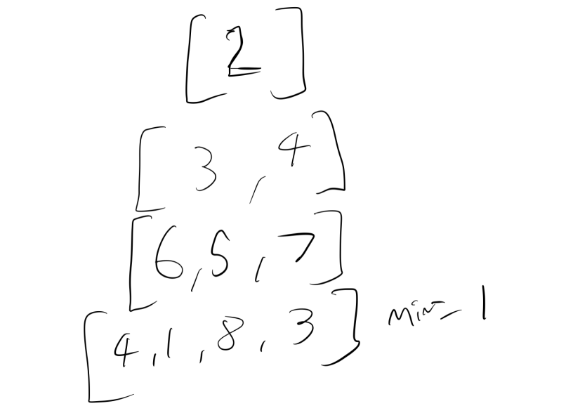

# Triangle


[https://leetcode.com/problems/triangle](https://leetcode.com/problems/triangle)


We've seen dynamic programming by starting at the top of the tree and working down \(top-down approach\). What if we went from the bottom up \(bottom-up approach\)?



Given a triangle, find the minimum path sum from top to bottom. Each step you may move to adjacent numbers on the row below.

For example, given the following triangle

```text
[
     [2],
    [3,4],
   [6,5,7],
  [4,1,8,3]
]
```

The minimum path sum from top to bottom is `11` \(i.e., **2** + **3** + **5** + **1** = 11\).



The first thing we want to do is error checking.

```python
        if not triangle:
            return 
```

Now we want to generate our table:  


```python
        memo = [None] * len(triangle)
        n = len(triangle) - 1
```

`memo` is our table for memoisation, and n is the length of the triangle.



Since we're working from the bottom-up, let's start there. Our base case is:

* The minimum value of the first row we calculate \(which is the bottom row\) is just the minimum amongst them all.

We don't need to do anything else. Our minimum here is 1.

Now our recurrence:  


* The minimum value will be the minimum of the pathsum of its two parents + the node's value.

We can calculate this with

$$
min[k][i]=min(memo[k+1][i], min[k+1][i+]) + A[k][i]
$$

Let's write the code.

We then start from the 2nd row from the bottom and go backwards.

```python
for i in range(len(A) - 2, -1,-1):  
```

This code says "go backwards from the 2nd row from the bottom in increments of -1". Essentially we are reading bottom to top, right to left.

Then we calculate for every element:

```python
for i in range(len(triangle) - 2, -1, -1):
    for j in range(len(triangle[i])):
        memo[j] = triangle[i][j] + min(memo[j], memo[j + 1])
```

And finally `return memo[0]`.

Putting this together we get

```python
class Solution:
    def minimumTotal(self, triangle):
        if not triangle:
            return 
        memo = [None] * len(triangle)
        n = len(triangle) - 1
        
        # bottom row
        for i in range(len(triangle[n])):
            memo[i] = triangle[n][i]
        
        for i in range(len(triangle) - 2, -1, -1):
            for j in range(len(triangle[i])):
                memo[j] = triangle[i][j] + min(memo[j], memo[j + 1])
        return memo[0]
```




